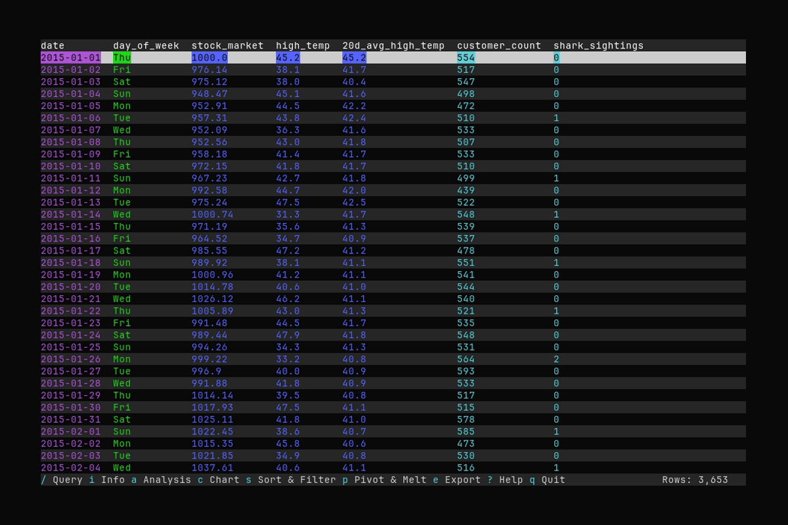

# Datui


**Datui** is a high-performance terminal UI for exploring and analyzing datasets. Powered
by the **Polars** engine and written in **Rust**, it brings SQL-like power and Excel-like
visibility to your CLI.

> Datui is in rapid development; features and interfaces are evolving.

📖 **Documentation**: [Full User Guide][docs].

## Demo



## Why Datui?

- 🚀 **Fast**: Powered by Polars streaming expressions for state-of-the-art performance on
  massive datsets
- 📁 **Universal**: Supports Parquet, CSV, JSON, Avro, Arrow, ORC, and Excel
- 🧰 **Flexible**: View data stored locally, on S3, or over HTTP/HTTPS
- 🔍 **Queryable**: Fuzzy search or query with SQL or an SQL-like DSL
- 📊 **Charts**: Render terminal-based charts and export them as images
- 🔬 **Analysis**: Use analytical tools to understand correlations, distributions, and more
- ⚒️ **Transformations**: Sort, filter, pivot, melt, and more
- ⌨️ **Keyboard-Driven**: Arrow keys and Vim-style navigation (`h`/`j`/`k`/`l`)


## Installation

Datui can be installed easily on Linux, macOS, and Windows. See the summary of each
option below. Visit the [Install Guide][install-guide] for additional details.

### ✨ Quick Install for Linux and macOS

```bash
curl -fsSL https://raw.githubusercontent.com/derekwisong/datui/main/scripts/install/install.sh | sh
```

*Don't like piping to shell? See the alternative methods below.*

### Pre-built Releases

Get the pre-built binary for your platform from the [Latest Release](https://github.com/derekwisong/datui/releases/latest).

### From Package Managers

> See [Package Managers][pkg-managers]

- **macOS (Homebrew)**:
  ```bash
  brew tap derekwisong/datui
  brew install datui
  ```
- **Arch Linux (AUR)**:
  - `paru -S datui-bin`
  - `yay -S datui-bin`
- **Pip**: `pip install datui` (See [Python Module][python-module])
- **Windows (WinGet)**: `winget install derekwisong.datui` *(Coming Soon)*


### From Source

> See [Compiling][compiling]

```bash
git clone https://github.com/derekwisong/datui.git
cd datui
cargo build --release
```

The binary will be available at `target/release/datui`.


## Quick Start

> See the [Quick Start Guide][quickstart-guide]

- 💻 Load a file, or hive-partitioned dataset, from the shell:
  ```bash
  datui /path/to/data.parquet
  datui --hive /path/to/directory
  datui --hive "/path/to/directory/**/*.parquet"
  ```
  > See [Loading Data][loading-data]
- ☁️ Load data from **S3** and **HTTP**:
  ```bash
  datui s3://some-bucket/file.parquet
  datui gs://some-bucket/file.parquet
  datui https://www.domain.com/file.csv
  ```
  > See [Loading Remote Data][loading-remote]
- 🐍 View data from Python:
  ```python
  import polars as pl
  import datui

  lf = pl.scan_parquet("/path/to/data.parquet")
  datui.view(lf)
  ```
  > See [Python Module][python-module]
- Use arrow keys or Vim-style keybinds (`h`/`j`/`k`/`l`) to navigate
- Press `q` to exit

> 💡 Use `?` or `F1` to show help


## Configuration

> See the [Configuration Guide][config-guide]

Generate a default [TOML](https://toml.io) config file:
```bash
datui --generate-config
```

## For Developers

### Setup

See the [Setup Script][setup-script] guide to quickly get configured to run the tests,
build docs, demos, and create packages build.

### Contributing

Contributions are welcome! Please see [Contributing][contributing] for more.

## License

This project is licensed under the MIT License - see the [LICENSE](LICENSE) file for details.

---

**Note**: If you encounter any issues or have feature requests, please [open an issue on GitHub](https://github.com/derekwisong/datui/issues).

[docs]: https://derekwisong.github.io/datui/
[config-guide]: https://derekwisong.github.io/datui/latest/user-guide/configuration.html
[install-guide]: https://derekwisong.github.io/datui/latest/getting-started/installation.html
[quickstart-guide]: https://derekwisong.github.io/datui/latest/getting-started/quick-start.html
[pkg-managers]: https://derekwisong.github.io/datui/latest/getting-started/installation.html#package-managers
[compiling]: https://derekwisong.github.io/datui/latest/getting-started/installation.html#compiling-from-source
[contributing]: https://derekwisong.github.io/datui/latest/for-developers/contributing.html
[setup-script]: https://derekwisong.github.io/datui/latest/for-developers/setup-script.html
[python-module]: https://derekwisong.github.io/datui/latest/user-guide/python-module.html
[loading-remote]: https://derekwisong.github.io/datui/latest/user-guide/loading-data.html#remote-data-s3-gcs-and-http
[loading-data]: https://derekwisong.github.io/datui/latest/user-guide/loading-data.html