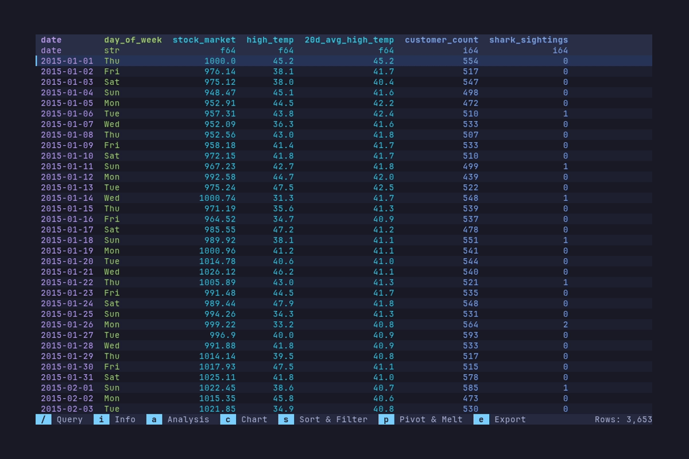

# Datui

[](https://github.com/derekwisong/datui/releases/latest)
[](https://crates.io/crates/datui)
[](https://pypi.org/project/datui/)
[](https://github.com/derekwisong/datui/releases)
[](https://github.com/derekwisong/datui/actions)
[](LICENSE)

**Datui** is a terminal UI for looking at tabular data: Parquet, CSV, JSON,
Arrow and more, on disk or in S3, GCS and HTTP, from a few rows to a few
billion.



```bash
datui data.parquet                    # open a file
datui --hive s3://bucket/warehouse/   # or a partitioned dataset in the cloud
datui                                 # or pick one from the home screen
```

Press `?` for the keys. `/` queries, `s` sorts and filters, `c` charts,
`a` analyzes, `q` quits. The [documentation][docs] has the rest.

## Install

```bash
curl -fsSL https://raw.githubusercontent.com/derekwisong/datui/main/scripts/install/install.sh | sh
```

| | |
|---|---|
| macOS | `brew tap derekwisong/datui && brew trust derekwisong/datui && brew install datui` |
| Windows | `winget install derekwisong.datui` |
| Arch Linux | `paru -S datui-bin` |
| Debian, Ubuntu | [apt repository][install-guide] |
| Python | `pip install datui` |
| Rust | `cargo install datui --locked` |
| Anything else | [Pre-built binaries][latest-release] for Linux, macOS and Windows |

See the [install guide][install-guide] for details and building from source.

## What it does

- **Opens the file where it is.** Local paths, `s3://` and `gs://` URLs, and
  hive-partitioned directories; HTTP URLs are fetched first. Parquet is read
  lazily through [Polars](https://pola.rs), one row group at a time, so a
  dataset larger than memory scrolls like a small one.
- **Shows you what is around you.** Run `datui` with no arguments for the
  [home screen][home-screen]: recent datasets, the current directory, your
  data directories, and the buckets your credentials can reach. Each row shows
  rows, columns and size before you open it; the schema is one keystroke away.
- **Answers questions.** SQL, a short [query language][query-syntax]
  (`select a, b where c > 10 by region`), and fuzzy text search across every
  column. Sort, filter, freeze and hide columns from a sidebar.
- **Summarizes.** Describe, distribution fitting with Q-Q plots, and a
  correlation matrix, computed on the data as filtered.
- **Draws.** Line, scatter, bar, histogram, box, KDE and heatmap charts in the
  terminal, exportable as PNG or EPS.
- **Reshapes and saves.** Pivot and melt, export to CSV, Parquet, JSON, NDJSON,
  Arrow or Avro, and templates that replay a query, filters and sort on the
  next dataset with the same shape.
- **Configurable.** Light and dark palettes with every color a config key,
  defaults for every option, and arrow keys or `h` `j` `k` `l`.

## From Python

```python
import polars as pl
import datui

datui.view(pl.scan_parquet("data.parquet"))   # a LazyFrame stays lazy
datui.view("s3://bucket/events/", hive=True)  # paths and URLs work too
```

See the [Python module][python-module].

## Configure

```bash
datui --generate-config
```

Data directories for the home screen, S3 endpoints, CSV defaults, number
formatting and every color live in one TOML file. See the
[configuration guide][config-guide].

## Contributing

Bug reports and feature requests go to the
[issue tracker](https://github.com/derekwisong/datui/issues); security problems
go to [SECURITY.md](SECURITY.md) instead. To build, test or contribute, start
with the [developer guide][for-developers].

Datui is MIT licensed. See [LICENSE](LICENSE).

[docs]: https://derekwisong.github.io/datui/
[install-guide]: https://derekwisong.github.io/datui/latest/getting-started/installation.html
[latest-release]: https://github.com/derekwisong/datui/releases/latest
[config-guide]: https://derekwisong.github.io/datui/latest/user-guide/configuration.html
[home-screen]: https://derekwisong.github.io/datui/latest/user-guide/home-screen.html
[query-syntax]: https://derekwisong.github.io/datui/latest/reference/query-syntax.html
[python-module]: https://derekwisong.github.io/datui/latest/user-guide/python-module.html
[for-developers]: https://derekwisong.github.io/datui/latest/for-developers.html
