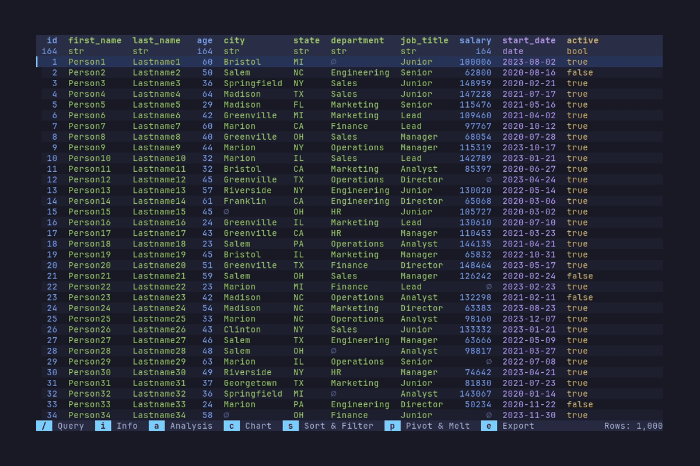

# datui

**A terminal UI for tabular data.**

Browse, filter, query, chart and export tables from local disk or cloud storage,
or from Polars DataFrames in Python.

<!-- generated: format-count -->
datui reads 27 formats: Parquet, CSV, TSV, PSV, JSON, NDJSON, Arrow IPC, Avro, ORC, Excel, SafeTensors, GGUF, NMEA, GPX, WAV/AIFF audio, MIDI, SQLite, VCD, FIX, SDF, NumPy, ELF, ULog, DataFlash, candump, plain text, systemd journal, and binary formats you describe in a format spec.
<!-- end generated: format-count -->

[](https://github.com/derekwisong/datui/releases/latest)
[](https://github.com/derekwisong/datui/actions)
[](LICENSE)

[Website][site] · [Documentation][docs] · [Quick start][quick-start] · [All demos][demos]

```bash,network
datui                     # home screen: your files and a catalog of public datasets
datui https://vincentarelbundock.github.io/Rdatasets/csv/palmerpenguins/penguins.csv
datui s3://noaa-ghcn-pds/parquet/by_year/YEAR=2024/   # 37 million rows of NOAA weather, no login
```



## Install

On Linux or macOS:

```bash,install
curl -fsSL https://raw.githubusercontent.com/derekwisong/datui/main/scripts/install/install.sh | sh
```

| Package manager | Command |
|---|---|
| Homebrew (macOS) | `brew tap derekwisong/datui && brew trust derekwisong/datui && brew install datui` |
| WinGet (Windows) | `winget install derekwisong.datui` |
| pip | `pip install datui` |
| Cargo | `cargo install datui --locked` |
| AUR (Arch Linux) | `paru -S datui-bin` |

The [installation guide][install-guide] covers apt, RPMs, user-only installs
and building from source. [Prebuilt binaries][latest-release] are also available.

## Keyboard controls

| Action | Key | Guide |
|---|---|---|
| Query with SQL, q or Text | `/` | [Queries][query-guide] |
| Sort, filter, hide or freeze columns | `s` | [Table controls][filter-guide] |
| Plot a trend or distribution | `c` | [Charts][chart-guide] |
| Describe columns, correlations or data quality | `a` | [Analysis][analysis-guide] |
| Pivot or melt | `p` | [Reshaping][reshape-guide] |
| Copy a result or export a file | `y` / `e` | [Copy][copy-guide] · [Export][export-guide] |
| Save a view to reuse on another file | `v` | [Views][views-guide] |

Press `?` for help on any screen. `Esc` backs out; `Ctrl+Q` quits.
The [quick start][quick-start] opens Palmer penguins from the built-in catalog
and asks which species is heaviest:

```sql,dataset=penguins,network,rows=3
SELECT species, AVG(body_mass_g) AS mean_mass_g, COUNT(*) AS penguins
FROM df GROUP BY species ORDER BY mean_mass_g DESC
```

Gentoo, at 5,076 g over 124 penguins.

Parquet and other scan-based formats use [Polars](https://pola.rs) to load rows
as needed. Queries, sorting and analysis can read much more than the visible
page; see [large datasets][performance].

## Python

`pip install datui` includes both the command and the Python module:

```python,network
import datui
import polars as pl

url = "https://vincentarelbundock.github.io/Rdatasets/csv/palmerpenguins/penguins.csv"
penguins = pl.scan_csv(url)
datui.view(penguins)

# Return the current query, filters and sort as a LazyFrame.
result = datui.view(penguins, capture=True)
if result is not None:
    print(result.collect())
```

[Python guide][python-module] · [Python API][python-api] · [Formats][formats] · [Open files][loading-guide]

## Configuration

Run `datui config init` to create a TOML config. It controls data
directories, cloud connections, number formatting and colors. See the
[configuration guide][config-guide] for the available settings.

## Contribute

[Open an issue][issues] for bugs and feature requests. The
[developer guide][for-developers] covers building, testing and contributing.
Report security issues using [SECURITY.md](SECURITY.md).

Built with [Polars](https://pola.rs) and [Ratatui](https://ratatui.rs).
Released under the [MIT license](LICENSE).

[site]: https://derekwisong.github.io/datui/
[docs]: https://derekwisong.github.io/datui/latest/
[quick-start]: https://derekwisong.github.io/datui/latest/getting-started/quick-start.html
[demos]: https://derekwisong.github.io/datui/latest/demos.html
[install-guide]: https://derekwisong.github.io/datui/latest/getting-started/installation.html
[latest-release]: https://github.com/derekwisong/datui/releases/latest
[query-guide]: https://derekwisong.github.io/datui/latest/user-guide/querying-data.html
[filter-guide]: https://derekwisong.github.io/datui/latest/user-guide/filtering-sorting.html
[chart-guide]: https://derekwisong.github.io/datui/latest/user-guide/charting.html
[analysis-guide]: https://derekwisong.github.io/datui/latest/user-guide/analysis-features.html
[reshape-guide]: https://derekwisong.github.io/datui/latest/user-guide/reshaping.html
[copy-guide]: https://derekwisong.github.io/datui/latest/user-guide/copying.html
[export-guide]: https://derekwisong.github.io/datui/latest/user-guide/exporting-data.html
[views-guide]: https://derekwisong.github.io/datui/latest/user-guide/views.html
[performance]: https://derekwisong.github.io/datui/latest/user-guide/large-datasets.html
[loading-guide]: https://derekwisong.github.io/datui/latest/user-guide/open-files.html
[python-module]: https://derekwisong.github.io/datui/latest/user-guide/python-module.html
[python-api]: https://derekwisong.github.io/datui/latest/reference/python-api.html
[formats]: https://derekwisong.github.io/datui/latest/formats/index.html
[config-guide]: https://derekwisong.github.io/datui/latest/user-guide/configuration.html
[for-developers]: https://derekwisong.github.io/datui/latest/for-developers.html
[issues]: https://github.com/derekwisong/datui/issues
