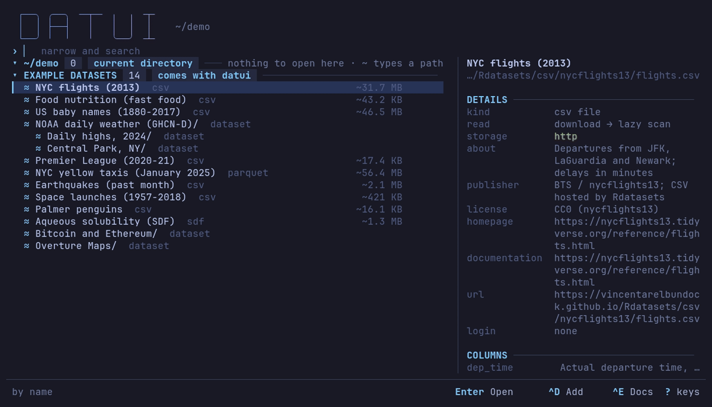

# datui

**Explore tabular data in your terminal.**

<!-- generated: pitch -->
Parquet, CSV, JSON, Arrow, Excel, SQLite, logs, audio, model files and more, including binary formats you describe in a format spec.
<!-- end generated: pitch -->

From local disk, S3, GCS, Azure or HTTP(S), a pipe, or a Polars frame in Python.

[](https://github.com/derekwisong/datui/releases/latest)
[](https://github.com/derekwisong/datui/actions)
[](LICENSE)

[Website][site] · [Documentation][docs] · [Quick start][quick-start] · [Formats][formats]



## Try it

```bash,network
datui     # home screen: your files, and Example datasets to open with no login
```

```bash,network
datui s3://noaa-ghcn-pds/parquet/by_year/YEAR=2024/   # 38 million rows of NOAA weather, no login
```

Press `?` for the keys on any screen. `Esc` backs out; `Ctrl+Q` quits.

## Install

<!-- generated: install -->
```bash,install
curl -fsSL https://raw.githubusercontent.com/derekwisong/datui/main/scripts/install/install.sh | sh
```

| Platform | Command |
|---|---|
| Windows, WinGet | `winget install derekwisong.datui` |
| [macOS, Linux, Homebrew](https://github.com/derekwisong/homebrew-datui) | `brew tap derekwisong/datui && brew trust derekwisong/datui && brew install datui` |
| [Python, PyPI](https://pypi.org/project/datui/) | `pip install datui` |
| [Rust, crates.io](https://crates.io/crates/datui) | `cargo install datui --locked` |
| [Arch Linux, AUR](https://aur.archlinux.org/packages/datui-bin) | `yay -S datui-bin   # or: paru -S datui-bin` |
| Debian, Ubuntu | [Apt repository](https://derekwisong.github.io/datui/latest/getting-started/installation.html#apt-repository) |
| Fedora, RHEL | [Dnf repository](https://derekwisong.github.io/datui/latest/getting-started/installation.html#dnf-repository) |
| Binaries | Linux, macOS and Windows binaries, `.deb`, `.rpm` and Arch tarballs on the [latest release](https://github.com/derekwisong/datui/releases/latest) |
<!-- end generated: install -->

More ways to install, and how to uninstall: the [installation guide][install-guide].

## How it stays fast

- Rust on [Polars](https://pola.rs). Every table is a `LazyFrame` until it is drawn.
- Only the rows on screen and a lookahead buffer are collected. Sort, filter
  and query build on the lazy plan.
- A Parquet file in S3, GCS or Azure is read in place: footers for the schema
  and row count, then only the row groups the screen needs.
- The row count runs in the background; the table is usable before it is done.

First rows in milliseconds on local files, under a second from S3.
[Performance][performance] has the numbers.

## What it does

| Task | Key or command | Guide |
|---|---|---|
| Find text, a regex or letters in order | `/` | [Find][find-guide] |
| Run SQL or q | `:` | [Queries][query-guide] |
| Sort by the cursor's column; keep or drop its value | `[` `]`, `+` `-` | [Sort and filter][filter-guide] |
| Value counts of a column | `F` | [Value counts][counts-guide] |
| Chart; export it to PNG, SVG or PDF | `c`, then `e` | [Charts][chart-guide] |
| Pivot or melt | `p` | [Reshaping][reshape-guide] |
| Change a column's type | `i`, Enter on the Schema tab | [Column types][types-guide] |
| Copy (OSC 52 over SSH) or export | `y`, `e` | [Copy][copy-guide] · [Export][export-guide] |
| Save the steps as a view for the next file | `v` | [Views][views-guide] |
| Read your own binary or delimited format | `datui --format SPEC.toml FILE` | [Format specs][spec-guide] |
| Follow a growing file; view a pipe as it arrives | `datui -f FILE`, `COMMAND \| datui` | [Pipes][pipes-guide] |
| Add a dataset to your catalog; read its documentation | `Ctrl+D`, `Ctrl+E` on the home screen | [Catalogs][catalog-guide] |
| Pick a theme | `datui theme list` | [Configuration][config-guide] |
| Click, scroll, drag a column, right-click a cell | Mouse | [Mouse][mouse-guide] |

## Where the data lives

| Source | Open it with |
|---|---|
| A file, a directory of files, a glob | `datui sales.parquet`, `datui events/`, `datui --hive 'logs/*/*.parquet'` |
| S3, GCS, Azure | `datui s3://BUCKET/KEY`, `gs://…`, `abfss://…`, or browse it from the home screen |
| HTTP(S) | `datui https://…` |
| Hive partitions | A `key=value` tree opens as one table, partition columns first |
| Standard input | `COMMAND \| datui` |
| Python | `datui.view(frame)` on a Polars `DataFrame` or `LazyFrame` |

The home screen lists your recent files, your directories, your catalogs, the
cloud accounts it finds logins for, and **Example datasets**: public data that
opens with no login. [Home screen][home-guide] · [Cloud storage][remote-guide]

## Python

`pip install datui` installs the command and the module:

```python,network
import datui
import polars as pl

url = "https://vincentarelbundock.github.io/Rdatasets/csv/palmerpenguins/penguins.csv"
penguins = pl.scan_csv(url)
datui.view(penguins)

# Return the current query, filters and sort as a LazyFrame.
result = datui.view(penguins, capture=True)
if result is not None:
    print(result.collect())
```

[Python guide][python-module] · [Python API][python-api]

## What it is not

- An editor: cells cannot be changed, and datui does not write to the files it
  opens unless you export over one. Results leave as an export or a copy.
- A service: no telemetry, no update check. datui connects only to the data
  and the cloud accounts you open or browse.

## Contribute

[Open an issue][issues] for bugs and feature requests. The
[developer guide][for-developers] covers building, testing and contributing.
Report security issues using [SECURITY.md](SECURITY.md).

Built with [Polars](https://pola.rs) and [Ratatui](https://ratatui.rs).
Released under the [MIT license](LICENSE).

[site]: https://derekwisong.github.io/datui/
[docs]: https://derekwisong.github.io/datui/latest/
[quick-start]: https://derekwisong.github.io/datui/latest/getting-started/quick-start.html
[install-guide]: https://derekwisong.github.io/datui/latest/getting-started/installation.html
[find-guide]: https://derekwisong.github.io/datui/latest/user-guide/finding.html
[query-guide]: https://derekwisong.github.io/datui/latest/user-guide/querying-data.html
[filter-guide]: https://derekwisong.github.io/datui/latest/user-guide/filtering-sorting.html
[counts-guide]: https://derekwisong.github.io/datui/latest/user-guide/value-counts.html
[chart-guide]: https://derekwisong.github.io/datui/latest/user-guide/charting.html
[reshape-guide]: https://derekwisong.github.io/datui/latest/user-guide/reshaping.html
[types-guide]: https://derekwisong.github.io/datui/latest/user-guide/dataset-info.html#column-types
[copy-guide]: https://derekwisong.github.io/datui/latest/user-guide/copying.html
[export-guide]: https://derekwisong.github.io/datui/latest/user-guide/exporting-data.html
[views-guide]: https://derekwisong.github.io/datui/latest/user-guide/views.html
[spec-guide]: https://derekwisong.github.io/datui/latest/formats/format-specs.html
[pipes-guide]: https://derekwisong.github.io/datui/latest/user-guide/pipes-and-follow.html
[catalog-guide]: https://derekwisong.github.io/datui/latest/reference/catalogs.html
[config-guide]: https://derekwisong.github.io/datui/latest/user-guide/configuration.html
[mouse-guide]: https://derekwisong.github.io/datui/latest/user-guide/mouse.html
[home-guide]: https://derekwisong.github.io/datui/latest/user-guide/home-screen.html
[remote-guide]: https://derekwisong.github.io/datui/latest/user-guide/remote-data.html
[performance]: https://derekwisong.github.io/datui/latest/reference/performance.html
[python-module]: https://derekwisong.github.io/datui/latest/user-guide/python-module.html
[python-api]: https://derekwisong.github.io/datui/latest/reference/python-api.html
[formats]: https://derekwisong.github.io/datui/latest/formats/index.html
[for-developers]: https://derekwisong.github.io/datui/latest/for-developers.html
[issues]: https://github.com/derekwisong/datui/issues
